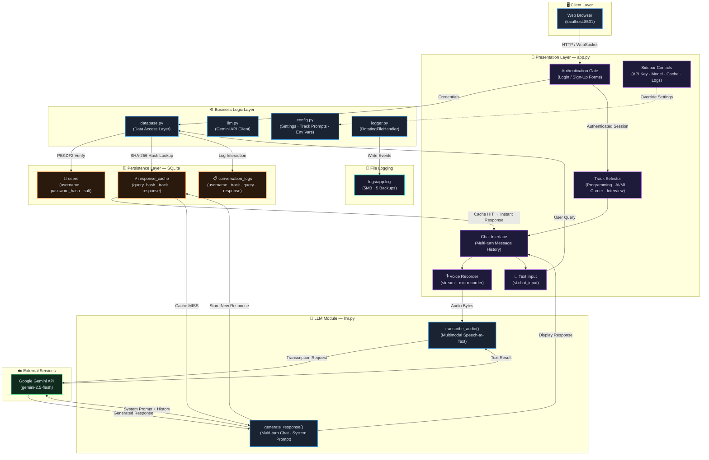

# AI-Powered Student Query Assistant

An interactive, production-ready study assistant for students. Built with **Streamlit** and the **Gemini API**, this application provides tailored support across four key academic and professional tracks.

---

## 🚀 Features

1. **Academic Tracks**: Specialized prompts and guides for:
   - **Programming**: Concept learning, syntax explanations, code debugging, and PEP 8 guidelines.
   - **AI/ML**: Analogies, mathematics, and code blocks for ML/DL models and frameworks (PyTorch, Scikit-Learn).
   - **Career Guidance**: Tech roles breakdown, learning roadmaps, portfolio ideas, and resume tips.
   - **Interview Prep**: Algorithmic problem-solving (DSA), Big-O complexity feedback, and behavioral guidance (STAR method).
2. **User Authentication**: Secure signup and login flow with salt-hashed password storage (using Python's native `hashlib.pbkdf2_hmac`).
3. **Session Management**: Independent multi-turn chat history preserved for each of the 4 tracks during a user session.
4. **Voice Input Feature**: Record queries directly in the browser. Voice commands are processed and transcribed using Gemini's native multimodal capabilities.
5. **Response Caching**: Computes cache hashes on user queries to instantly return cached responses, saving API limits and costs.
6. **Robust Logging**: Double-layered logging:
   - **App Logs**: Standard logging to `logs/app.log` utilizing `RotatingFileHandler`.
   - **Database Logs**: Persistent conversation metrics written to a SQLite database.
7. **Premium Styling**: Sleek, modern dark glassmorphism interface, custom gradients, and smooth responsive layouts.

---

## 🏗️ System Architecture



### Architecture Overview

| Layer | Component | Responsibility |
|-------|-----------|---------------|
| **Presentation** | `app.py` (Streamlit) | UI rendering, session state, routing, and glassmorphism styling |
| **Authentication** | `database.py` → `users` table | PBKDF2-HMAC-SHA256 password hashing with per-user salts |
| **Track Routing** | `config.py` → `TRACK_PROMPTS` | Maps each track to a specialized system prompt for the LLM |
| **Cache** | `database.py` → `response_cache` table | SHA-256 keyed query deduplication to save API costs |
| **LLM Integration** | `llm.py` → Gemini API | Multi-turn chat generation and multimodal audio transcription |
| **Persistence** | SQLite (`student_assistant.db`) | Users, cached responses, and conversation logs |
| **Logging** | `logger.py` → `logs/app.log` | Rotating file handler (5 MB × 5 backups) + console output |

### Request Lifecycle

1. **User submits a query** via text input or voice recording
2. **Voice path**: Audio bytes are sent to Gemini for multimodal transcription → returned as text
3. **Cache check**: Query + track are SHA-256 hashed and looked up in `response_cache`
4. **Cache HIT** → Response served instantly from SQLite (no API call)
5. **Cache MISS** → `llm.generate_response()` sends the query with full chat history and track-specific system prompt to Gemini
6. **Response stored** in cache for future identical queries
7. **Interaction logged** to `conversation_logs` table for the authenticated user

---

## 📁 Directory Structure

```
AI-Powered-Student-Query-Assistant/
├── config.py             # System configurations, settings, and track prompts
├── database.py           # Database models (SQLite) for Auth, Cache, and logs
├── llm.py                # Gemini API client, text generation, and audio transcription
├── logger.py             # File-based logging setup (logs/app.log)
├── app.py                # Streamlit UI, multi-turn state, and page routing
├── requirements.txt      # Project library dependencies
└── README.md             # This setup guide and overview
```

---

## 🛠️ Setup & Installation Guide

### Prerequisites
- Python **3.12.8** (tested and verified)
- Modern web browser (Chrome, Edge, or Safari for audio recording permissions)
- A **Gemini API Key** from [Google AI Studio](https://aistudio.google.com/)

### Step-by-Step Setup

1. **Clone or Open the Repository**
   Ensure your shell is positioned in the project root:
   ```powershell
   cd "C:\Users\VICTUS\Documents\Studying Projects\AI-Powered-Student-Query-Assistant"
   ```

2. **Create and Activate a Virtual Environment**
   ```powershell
   python -m venv .venv
   .venv\Scripts\Activate.ps1
   ```

3. **Install Dependencies**
   ```powershell
   pip install -r requirements.txt
   ```

4. **Configure Your API Key**
   Create a `.env` file in the root directory:
   ```env
   GEMINI_API_KEY=your_actual_gemini_api_key_here
   ```
   *Note: If no API key is specified in the `.env` file, you can enter it directly on the app's sidebar settings during runtime.*

5. **Run the Application**
   ```powershell
   streamlit run app.py
   ```
   The local server will spin up and launch a browser tab (usually at `http://localhost:8501`).

---

## 🔬 Technical Design Details

### 🔒 Security
Passwords are hashed using a cryptographically secure random salt and the `PBKDF2` algorithm with 100,000 iterations of SHA-256. Salts are stored alongside hashes. Secure string comparisons are conducted using `secrets.compare_digest` to mitigate timing attacks.

### ⚡ Caching Mechanism
Queries are hashed (combining track and text content) using SHA-256. Upon submission, the cache table is scanned. On a **Cache Hit**, the generated response is served instantly from the SQLite database. On a **Cache Miss**, Gemini generates the response, which is then written to the SQLite cache table.

### 🎙️ Audio Transcription
The front end captures WAV bytes via `streamlit-mic-recorder`. The raw audio bytes are sent to Gemini (`gemini-1.5-flash`) with a strict transcribing directive. The returned plain text query is processed as a standard prompt, maintaining session chat history.

### 📈 Conversational Memory
The app constructs conversations using Google GenAI's `model.start_chat(history=...)` utility. Standard application histories are translated from user-session states to structural API history contexts.
